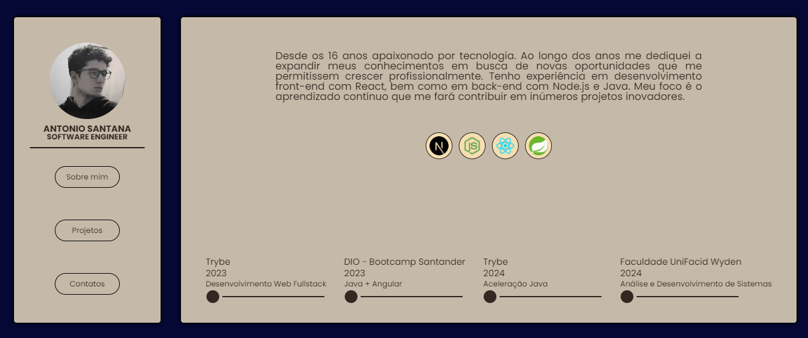

<p align="center">
  
</p>

<h3 align="center">Portfolio</h3>

<div align="center">

[](https://github.com/antonioclp/new-portfolio) 
[](https://github.com/antonioclp/new-portfolio)
[](/LICENSE)

</div>

> [!NOTE]\
> Portfolio that show informations, description and some important projects.

<p align="start">
  
</p>

### Usage

```bash
git clone git@github.com:antonioclp/new-portfolio.git

cd new-portfolio

npm install && npm run dev
```

---

### Eslint

```json
{
  "extends": [
    "@rocketseat/eslint-config/next", 
    "next/core-web-vitals"
  ]
}
```
